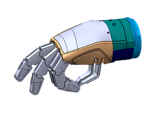

# Oded Hand Mechanical Design  

This project is a sub-project of Haifa3D Robotic Hand.
In this project, we present the mechanical design of the Oded Hand – a 3D printed robotic hand with five micro-DC motors. 
The aim of this design is to be low cost, accessible, easy to assemble, robust and lightweight.  

     

## Design Description  
The Oded Hand can perform a variety of user-defined hand configurations using an autonomous adaptive grip along with a variety of grip force levels.
The mechanical design consists of four fingers with four different tendon-driven mechanisms actuated by four different micro-DC motors, a passive thumb with two discrete positions using two magnets and wrist rotation driven by planetary gears and a DC motor. 
Each finger is an independent module, hence from a developer point-of-view, you can check new finger designs and change the number of fingers in your hand model. For more details, see the [project presentation](docs/project_presentation.pdf)
All five independent micro-DC motors are driven by a microcontroller system which measures the motors’ current state (see our [Electronic Design](https://github.com/Haifa3D/hand-electronic-design)) and communicate via Bluetooth with additional sensors or systems (see our [Mobile App](https://github.com/Haifa3D/haifa3d-hand-app)).  

## Who can benefit from this Design?  
The design is suitable for users with a below elbow amputation.
We welcome any new developers to enhance our design or to use the Oded Hand as a simulator for your new sensors/algorithms/methods that would potentially help users to control their prosthetic hand.

## Design Files and Versions  
See our detailed [Manual](docs/manual_05dec20.pdf), including printing parameters, assembly instruction and images. *Notice: some of the images are from our previous version but the current version assembly and functionality can be deduced easily according to the same instructions.*
The STL files can be found [here](stl_files) as a folder or [here](stl_files.zip) as a zip file ready to download. The source files (SolidWorks2020) can be found [here](SW20_files) as well as the [Parasolid parts](xt_files).

## Getting Started:
To build the Oded Hand you will need a basic knowledge of 3D-printing and an access to a 3D printer. 

We use the UP mini 2 printer + ABS / SnapMaker2 + PLA

* Please refer to the [user manual](docs/manual_05dec20.pdf) **before printing** the files for printing parameters, recommendation and more.

* Please download all STL files ([folder](stl_files) or as a [zip file](stl_files.zip)).

* Oded Hand parts list:

 
| Part Name | Quantity | Hand Module | Right/Left Hand
| --- | --- | --- | --- |
| Gear Finger	| 3x4	 |Finger| Both |
| Gear Finger NR	| 1x4	 |Finger| Both |
| Proximal Phalange	| 1x4	 |Finger| Both |
| Middle Phalange	| 1x4	 |Finger| Both |
| Distal Phalange	| 1x4	 |Finger| Both |
| Pinion D* (or Pinion)	| 1x4	 |Finger Driver| Both |
| Pulley Clip	| 1x4	 |Finger Driver| Both |
| Finger Motor Chassis	| 1x4	 |Finger Driver| Both |
| Single Pulley	| 1x4	 |Finger Driver| Both |
| Palm Cover	| 1	 |Palm| Right** |
| Palm	| 1	 |Palm| Right** |
| Finger module holder	| 1	 |Palm| Right** |
| Thumb	| 1	 |Palm| Right** |
| Planetary Gear	| 3	 |Wrist| Both |
| Wrist Pinion D* (or Wrist Pinion)	| 1	 |Wrist| Both |
| Rotator Housing	| 1	 |Wrist| Right** |
| Rotator Upper Adaptor	| 1	 |Wrist| Right** | 
| Rotator Lower Adaptor	| 1	 |Wrist| Right** |
| Rotator Base	| 1	 |Wrist| Both |
| Wrist Cover	| 1	 |Wrist| Both |

\* D-shape is preferable. 
\** Parts need to be mirrored for left hand model. 

* tools and materials list

  **tools:**
  1. Nippers
  2. Soldering iron and solder
  3. Flat file
  4. Drill (optional)
  
  **Materials:**
  1.	Common Filament (Ø1.75 [mm])
  2.	Thick filament (Ø2.85 [mm])
  3.	Nylon thread 0.6 diameter[mm]
  4.	Silicon tube (outer diameter 8 [mm])
  5.	1 Stainless Steel Rod Ø4x30 [mm] (length 29-34[mm] are also optional)
  6.	2 Magnet N52 Ø6x4
  7.	5 Hex headless screw M3x4 or M3x5
  8.	1 Machined Screw and nut M2x8 [mm] (length 8-10[mm] are also optional)
  9.	6 self-tap Screws M2x8
  10.	2 Machine screws and nuts M3x40 [mm]
  11.	Electrical Wire for ~0.5 [amp]
  12.	5 micro metal gear motors – for the full electrical specification see the electronic design manual.

After you complete the mechanical assembly of the Oded Hand according to the [Manual](docs/manual_05dec20.pdf), please refer to the [Electronic Design](https://github.com/Haifa3D/hand-electronic-design) to assemble the PCB. If you have already assembled the mechanical and the electrical parts, you are welcome to check out our [Mobile App](https://github.com/Haifa3D/haifa3d-hand-app) to refine the controller parameters and to define your favorite hand movements.

## Acknowledgements:
This project was done by a group of great people and with the help and guidance of generous organizations.

*Mechanical design*:  Oded Katzman, Shunit Polinsky, Frank Schenk, Avital Dellariccia, SU-PAD company and Taga Product Design Company, Israel.

*Users Communication*: Haifa 3D – a nonprofit organization that designs and builds hands for free, founded by Yoav Medan and Yacov Malinovich.

*Resources*: The Technion - Israel Institute of Technology and special thanks to Prof. Alon Wolf and the Biorobotics and Biomechanics Lab.
